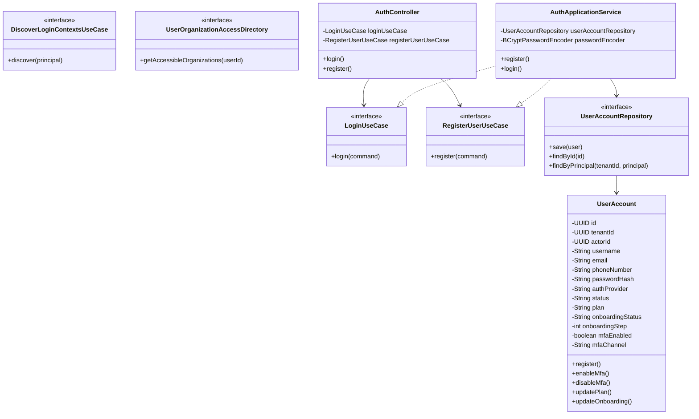
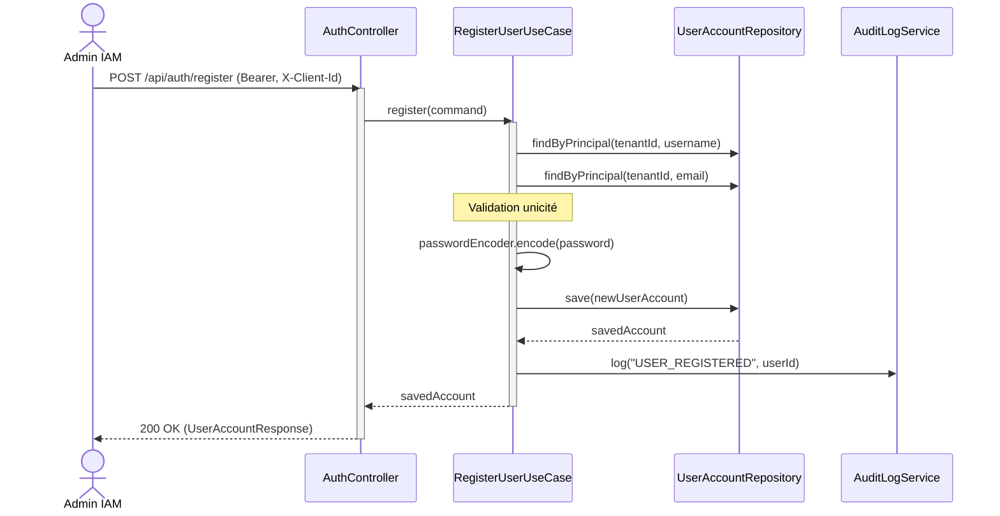
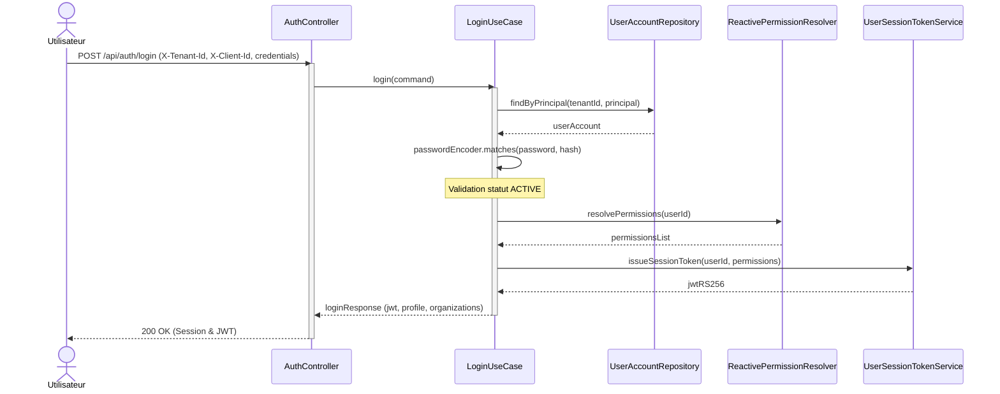
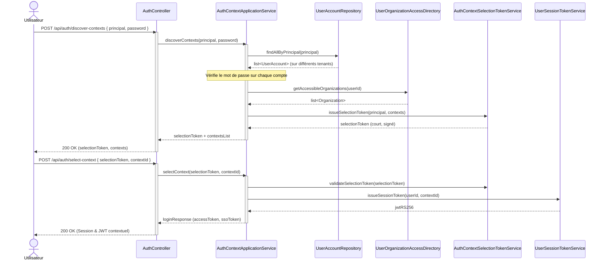

# Codes Mermaid pour les Diagrammes du Rapport YowAuth

Ces diagrammes correspondent à ceux référencés dans le document LaTeX `main.tex`. Vous pouvez copier les codes ci-dessous et les coller directement dans **draw.io** (via le menu *Organiser -> Insérer -> Avancé -> Mermaid*).

---

## 1. Diagramme de classes (`auth-core-class`)



---

## 2. Diagramme de cas d'utilisation (`auth-core-usecase`)

```mermaid
graph TD
    User([Utilisateur final])
    Admin([Administrateur IAM])
    App([Application Cliente])
    
    subgraph YowAuth ["YowAuth (auth-core)"]
        UC1[S'inscrire (Public Sign-Up)]
        UC2[S'authentifier (Login 2 étapes & MFA)]
        UC3[Découvrir les contextes d'organisation]
        UC4[Sélectionner le contexte actif]
        UC5[Gérer son profil (Plan, MFA, Onboarding)]
        UC6[Échanger un jeton SSO (Token Exchange)]
        UC7[Créer un compte utilisateur]
    end
    
    User --> UC1
    User --> UC2
    User --> UC4
    User --> UC5
    
    Admin --> UC7
    
    App --> UC3
    App --> UC6
    
    UC2 -.->|include| UC4
```

---

## 3. DS-AU-01 — Création d'un compte par un administrateur IAM



---

## 4. DS-AU-02/03 — Authentification tenant-scoped et émission du JWT



---

## 5. DS-AU-07/08 — Découverte et sélection de contexte (Login Global)


