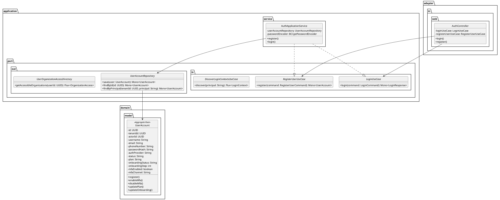
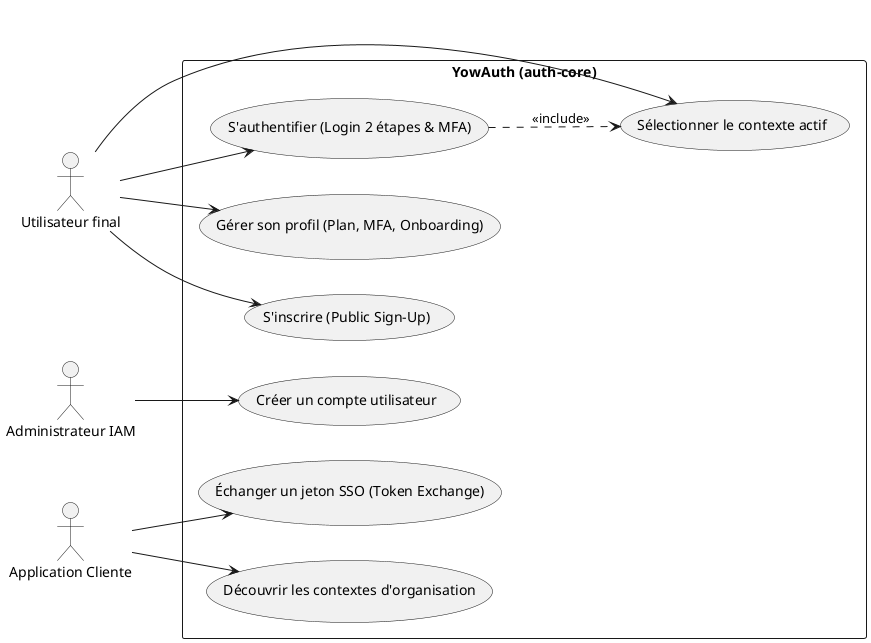
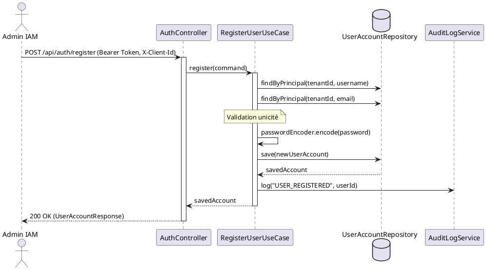
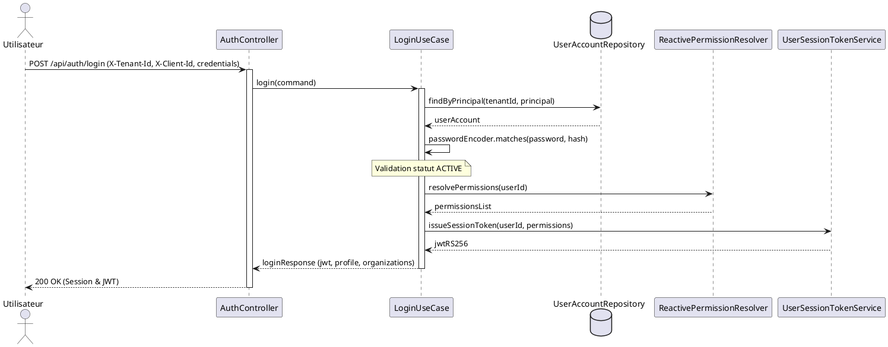

# Codes PlantUML pour les Diagrammes du Rapport YowAuth

Ces diagrammes correspondent à ceux référencés dans le document LaTeX `main.tex`. Vous pouvez copier les codes ci-dessous pour les coller directement dans **draw.io** (via le menu *Organiser -> Insérer -> Avancé -> PlantUML*) ou les compiler sur [PlantText](https://www.planttext.com/) / [PlantUML Web](http://www.plantuml.com/plantuml).

---

## 1. Diagramme de classes (`auth-core-class.puml`)



---

## 2. Diagramme de cas d'utilisation (`auth-core-usecase.puml`)



---

## 3. DS-AU-01 — Création d'un compte par un administrateur IAM



---

## 4. DS-AU-02/03 — Authentification tenant-scoped et émission du JWT



---

## 5. DS-AU-07/08 — Découverte et sélection de contexte (Login Global)

```plantuml
@startuml
actor "Utilisateur" as User
participant AuthController as Ctrl
participant AuthContextApplicationService as Service
database UserAccountRepository as Repo
participant UserOrganizationAccessDirectory as OrgDir
participant AuthContextSelectionTokenService as SelToken
participant UserSessionTokenService as JWTService

%% Étape 1 : Découverte
User -> Ctrl: POST /api/auth/discover-contexts { principal, password }
activate Ctrl
Ctrl -> Service: discoverContexts(principal, password)
activate Service
Service -> Repo: findAllByPrincipal(principal)
Repo --> Service: list<UserAccount> (sur différents tenants)
Note over Service: Vérifie le mot de passe sur chaque compte
Service -> OrgDir: getAccessibleOrganizations(userId)
OrgDir --> Service: list<Organization>
Service -> SelToken: issueSelectionToken(principal, contexts)
SelToken --> Service: selectionToken (court, signé)
Service --> Ctrl: selectionToken + contextsList
deactivate Service
Ctrl --> User: 200 OK (selectionToken, contexts)
deactivate Ctrl

%% Étape 2 : Sélection
User -> Ctrl: POST /api/auth/select-context { selectionToken, contextId }
activate Ctrl
Ctrl -> Service: selectContext(selectionToken, contextId)
activate Service
Service -> SelToken: validateSelectionToken(selectionToken)
Service -> JWTService: issueSessionToken(userId, contextId)
JWTService --> Service: jwtRS256
Service --> Ctrl: loginResponse (accessToken, ssoToken)
deactivate Service
Ctrl --> User: 200 OK (Session & JWT contextuel)
deactivate Ctrl
@endum
```
